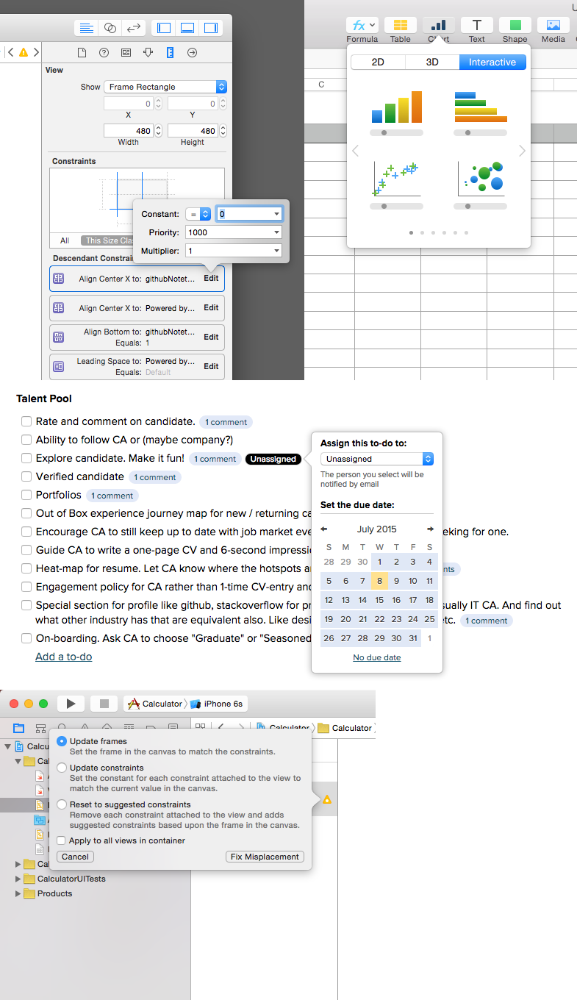

## UI

> The UI is part of user's digital body language - [How UI twist your words](https://medium.com/user-experience-design-1/facebook-and-how-uis-twist-your-words-4ceedc5fd93#.838m03i70)


* [**Flat 2.0**](http://articles.dappergentlemen.com/2014/12/03/flat-design-2/)
* [**Low contrast Text is not the answer**](https://www.nngroup.com/articles/low-contrast/)
* [7 rules for creating nice UI](https://medium.com/@erikdkennedy/7-rules-for-creating-gorgeous-ui-part-1-559d4e805cda#.qd6qv5nia)
* [Good Design](https://medium.com/the-year-of-the-looking-glass/good-design-a89c15136ba6#.helibco8c)
* [**UXmill**](http://uxmill.com/)
* [**Object-Oriented UX**](http://alistapart.com/article/object-oriented-ux)
* [**Visibility of system status**](http://www.nngroup.com/articles/ten-usability-heuristics/)
* [**Destroying Apple's legacy**](http://cheerfulsw.com/2015/destroying-apples-legacy)
* [**Pure-UI**](http://rauchg.com/2015/pure-ui/)
* [**The Command Pattern**](http://gameprogrammingpatterns.com/command.html)
* [**A Good UI**](https://www.goodui.org)
* [Well-designed interfaces look boring](https://medium.com/mission-log/well-designed-interfaces-look-boring-568faa4559e0)
* [**Spatial Interfaces**](https://medium.com/elepath-exports/spatial-interfaces-886bccc5d1e9)
* [UI mechanics of a date pickers](https://medium.com/@adhithyarkumar/ui-mechanics-of-a-date-picker-792f2aceb8aa)
* [**How to fix a bad UI**](http://scotthurff.com/posts/why-your-user-interface-is-awkward-youre-ignoring-the-ui-stack)
* [How to use photography in UI](http://designerfund.com/bridge/how-to-use-photography-in-ui/)
* [Design smarter push notifications](https://medium.com/ux-for-india/smarter-push-notifications-9bdaf7a35f3c)
* [**Responsive sidebar**](http://codyhouse.co/gem/responsive-sidebar-navigation/)
* [**Wayfinding**](https://viget.com/inspire/wayfinding)
* [**Which input when?**](http://morgancarter.com.au/design-solutions/which-input-when/)
* [**Design principles: Choosing the right patterns**](https://blog.intercom.io/design-principles-choosing-the-right-patterns/)
* [**Gimmicks and patterns in interface design**](https://blog.intercom.io/gimmicks-and-patterns-in-interface-design/)
* [Designing for various states](https://medium.com/@_mikehlee/designing-for-various-states-823816e49c8d#.m3v9p5re7)
* [Will UI designers be unemployed soon?](https://medium.com/swlh/will-ui-designers-be-unemployed-soon-edaffe9e5f1b)
* [Can you code this UI concept?](https://stories.uplabs.io/can-you-code-this-design-concept-efe0132b9744#.sx31zywjf)
* [How Tabs Should Work](https://24ways.org/2015/how-tabs-should-work/)
* [Graphical UI Gallery](http://www.guidebookgallery.org/)
* Construct your page with **hierarchy**. Visual weight.
* Don't present data or information that is disconnected from the user's past experience with your brand or product. No one wants things to happen or appear randomly. Ambiguity will lose users.
* **Symmetry of interaction**. How you trigger is how you will will reverse the action. Activation and deactivation actions must be symmetrical.
* Interaction happens with the content. The content is the interface! The actions feel close to the objects being interacted with. How can we bring tools nearer to the content to make the interaction as lightweight as possible.
* Interfaces should strive to be mode-less. Soft mode is okay as it does not trap user in the mode.
* Easy to understand, easy to target (Fitts's Law), and quick to execute. This will make them feel lightweight.
* **No matter how cool your interface is, less of it would be better**
* Follow users' mental models
* Provide choices rather than ask questions
* Provide modeless feedback
* Design for the probable but anticipate the possible
* Contextualize information
* Reflect object and application status
* Avoid unnecessary reporting
* Elegance - Graceful way of solving a design problem
* Design is the process of taking the available data and coming up with its representation. See [Pure-UI](http://rauchg.com/2015/pure-ui/)
* They want "fast" and "good-enough". Make boring UI.
* Computers are starting to outpace the computational abilities of our brains. The more we can do with a tool, the more the interface has to get out of the way. Sometimes, we can do so much with a tool, that we need the help of AI to unlock its full potential. This isn't just a simplification of interface; it's a complete shift in how we design our digital tools.
* When you do things right, people won't be sure you've done anything at all.
* A great designer knows how to work with text not just as content, he treats text as a user interface.
* Each section in your site needs to tell a story. It needs a reason and a final outcome for the user, The layout needs to help the content highlighting what are the most important pieces in that story. In reality there shouldn't be too many call outs on a page so everything should drive to that final "What can I do here".
* Satisficing - Sacrifice the "perfect" for "good enough" in order to conserve mental resources.
* Redundancy in cues is an asset, not a liability
* Pretty conceptual, but Scorekeeper does a great job of creating focus
* Creating focus
* Isolates modes
* Detailed & actionable
* Don't risk oversimplification.
* Be accurate and predictable
* Use progressive disclosure (esp. for expert user)

When it comes to the design of complex behaviors and interactions, we've found that focusing too early on pixel pushing, widget design, and specific interactions can get in the way of effectively designing a comprehensive framework in which all the product's behaviors can fit. Instead, we need to consider the big picture first and rendering our solutions in low-fidelity manner.

## Zero UI

Get rid of all the stuff in our UI, primarily is visual. Enjoy the content, not adjusting the settings.

Struggle to learn interface.

## Labelling and Language

## Name

* [Some UI component names for consideration](https://github.com/eonist/Element)

```
SelectButton
CheckButton
TextButton
SelectTextButton
Stepper
LeverStepper
ComboBox
VSlider
HSlider
ScrubBar
MovePanel
HorizontalRuler
RefreshableScrollView
DismissDialog
```

## UI Refactoring and Expansion

* [**Product Design Debt - incrementally-developed UI that are never refactored often turn into a Las Vegas**](http://andrewchen.co/product-design-debt-versus-technical-debt/)

We must design UI for refactoring and possibility of expansion. This is hard to do. You cannot predict what new features you may add.

Important navigational areas like homepage, inboxes, notifications, etc are all the same way.

You want to avoid messy A/B tests and UX pollution.

The more diverse activities you have, the more little features you want to expose, the more you need to design flexible and adaptable UI. Make the navigation paradigms scalable.

## User Goals, Needs, Motivations, Behaviors, JTBD

*Design of behavior* is a different kind of problem that requires greater knowledge of *context*.

When companies *do* focus on users, they tend to pay too much attention to the *tasks* users engage in rather than the *goals* in performing those tasks.


## Goal-Oriented vs Activity-Centered Design


## Component Libraries

* [Multi-select](http://davidstutz.github.io/bootstrap-multiselect/)
* 


**Principles**

1. Make it direct
2. Keep it lightweight

## Discoverability vs Readability

We want to make UI naturally discoverable, but we also do not want to clutter the chrome with many buttons, CTAs, etc. This tension always exist and must be balanced out depending on context and current user's needs.

Visual noise is the number one concern for putting too much weight on discoverability.

Using another interaction as a teachable moment to guide the user to a richer interactions is a good way to solve discoverability issues. Look for opportunities for teachable moments in the interface leading users to advanced features.

> Showing tools would compete with the list itself. The tools actions may be important, but making the content clear and readable is a higher priority.

* Static Invitation
* Dynamic Invitation

## Microstates: Interesting moments

There are a number of individual states at which interaction is possible. We call these microstates *interesting moments*. It is the Microinteraction!

## Patterns

### Overlay

* For multiple-field editing
* Demand user's full attention
* If you don't need inline context while editing
* Use overlay when large number of fields needed to be edited
* When editing is not frequent
* For single entity

### Drop-down Editor

> Drop downs should be the UI of last resort - @lukew

* [**Tether**](http://github.hubspot.com/tether/docs/welcome/)



### Group Edit

Use when you have a list of items stacking together. Balance between visual noise and discoverability.

### Empty state, Skeleton, Blank Slate

* [Facebook placeholder for unloaded content](https://www.designernews.co/stories/56465-facebook-placeholders-for-unloaded-content)
* [Avoid the spinner](http://www.lukew.com/ff/entry.asp?1797)
* [Tips for creating a blank slate](http://blog.teamtreehouse.com/tips-for-creating-a-blank-slate)

## Lists

Anytime you have a list, you need to think about categorisation, grouping, filtering. Sooner or later, the list will become huge and unmanageable. You should study the information architecture of your lists of things and consider segmentation and categorisation.

### Autocomplete and Pick list


## Menu Buttons (Muttons)

* You have a default action, but alternate actions are still fairly frequent

# Videos

* [User Interface (UX) Techniques](https://www.youtube.com/watch?v=7OSkB4BCx00)
* [Why you're over-thinking your UI/UX](https://www.youtube.com/watch?v=Is2O666qDPs)